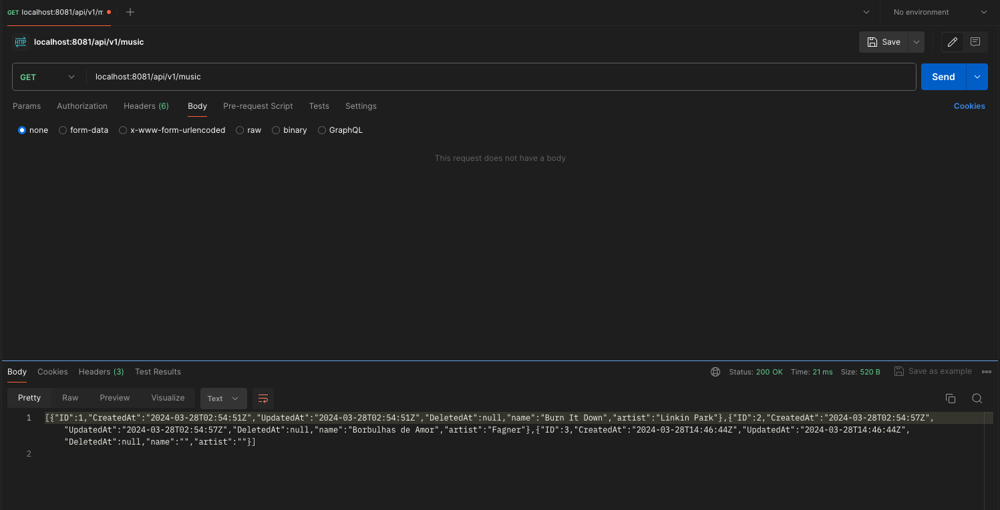

# go-music-k8s

```plaintext
.
├── README.md
├── backend
│   ├── Dockerfile
│   ├── api
│   │   └── server
│   │       ├── handlers.go
│   │       └── server.go
│   ├── backend
│   ├── config
│   │   ├── config.go
│   │   └── env
│   ├── go.mod
│   ├── go.sum
│   ├── internal
│   │   ├── db
│   │   │   ├── db.go
│   │   │   └── sql.sh
│   │   └── musicapp
│   │       ├── init.go
│   │       ├── music_dao.go
│   │       ├── music_methods.go
│   │       ├── musicapp_test.go
│   │       └── types.go
│   └── main.go
├── deploy
│   ├── helm
│   └── k8s
│       ├── backend
│       │   ├── musicapi
│       │   │   ├── configmap-musicapi.yaml
│       │   │   ├── deployment-musicapi.yaml
│       │   │   ├── ns-musicapi.yaml
│       │   │   ├── secret-musicapi.yaml
│       │   │   └── service-musicapi.yaml
│       │   └── mysql
│       │       ├── deployment-mysql.yaml
│       │       ├── ns-mysql.yaml
│       │       ├── pvc-mysql.yaml
│       │       ├── secret-mysql.yaml
│       │       └── service-mysql.yaml
│       └── frontend
│           └── Work In Progress
├── docker-compose.yaml
```

## Ambiente

O ambiente escolhido foi [Kubernetes](https://kubernetes.io/) através do [minikube](https://minikube.sigs.k8s.io/docs/start/).

```
curl -LO https://storage.googleapis.com/minikube/releases/latest/minikube-darwin-amd64
sudo install minikube-darwin-amd64 /usr/local/bin/minikube
minikube start
```

A partir de então, podemos interagir com a aplicação através do [kubectl](https://kubernetes.io/docs/tasks/tools/).

## Entrypoint

O entrypoint para nossa aplicação será o `main.go` na raiz da pasta `backend`.

Ela executará a função main() que irá iniciar o servidor web Golang:

```go
var cfg *config.Config
var err error

func init() {
	log.Print("Welcome to music api...")

	// get a config
	cfg, err = config.NewConfig()
	if err != nil {
		log.Fatal("Config init failed", err)
	}

	// migrate db
	if err = musicapp.DbInit(cfg.DB); err != nil {
		log.Fatal("DB migration failed...")
	}
}

func main() {
	server.Start(cfg)
}
```

Aqui, temos uma função `init()` que irá:

- inicializar a configuração do app
- inicializar o banco de dados

Confira a configuração do app. As mesmas credenciais de configuração serão fornecidas ao nosso app através do ConfigMap e Secret do k8s.

```bash
# env
CONFIG_DBHOST # host do banco de dados
CONFIG_DBNAME # nome do banco de dados
CONFIG_DBPASS # senha do banco de dados
CONFIG_DBUSER # usuário do banco de dados
CONFIG_SERVER_PORT # porta do servidor web
```

## Database

Para simplificar, utilizei o GORM, um ORM para Go. Song será uma das entidades em nosso banco de dados.

```go
type Song struct {
	gorm.Model
	Name   string `json:"name"`
	Artist string `json:"artist"`
}
```

Por padrão, gorm.Model inclui os seguintes campos:

```go
type Model struct {
	ID        uint `gorm:"primarykey"`
	CreatedAt time.Time
	UpdatedAt time.Time
	DeletedAt DeletedAt `gorm:"index"`
}
```

Essa estrutura permite a manipulação eficiente de registros de músicas no banco de dados, aproveitando as funcionalidades do GORM para operações CRUD, além de gerenciamento automático de campos comuns como ID, CreatedAt, UpdatedAt, e DeletedAt.

## API

Nossa aplicação inclui um conjunto completo de endpoints CRUD para gerenciamento de músicas, definidos em server/server.go.

### Endpoints

- GET /api/v1/music: Busca todas as músicas no banco de dados.
- POST /api/v1/music: Adiciona uma nova música ao banco de dados.
- PUT /api/v1/music/{id}: Atualiza uma música existente pelo ID.
- DELETE /api/v1/music/{id}: Remove uma música do banco de dados pelo ID.

### Handlers

Os handlers para cada operação estão implementados em `handlers.go`. A seguir, um resumo de cada um:

- `GetSongHandler`: Realiza a busca de todas as músicas disponíveis e as retorna em formato JSON.
- `PostSongHandler`: Recebe uma nova música em formato JSON, adiciona ao banco de dados e retorna uma mensagem de sucesso.
- `UpdateSongHandler`: Atualiza os detalhes de uma música existente com base no ID fornecido e nos dados enviados. Retorna uma mensagem de sucesso após a atualização.
- `DeleteSongHandler`: Remove uma música especificada pelo ID do banco de dados e retorna uma mensagem confirmando a remoção.

### Server

O servidor é configurado e iniciado em server.go, onde os endpoints são associados aos seus respectivos handlers e a aplicação começa a escutar em uma porta especificada.

```go
package server

import (
	"log"
	"net/http"

	"github.com/gorilla/mux"
	"github.com/kaiohenricunha/go-music-k8s/backend/config"
)

var gcfg *config.Config // global config for server

func Start(cfg *config.Config) {
	gcfg = cfg
	r := mux.NewRouter()

	r.HandleFunc("/api/v1/music", GetSongHandler).Methods("GET")
	r.HandleFunc("/api/v1/music", PostSongHandler).Methods("POST")
	r.HandleFunc("/api/v1/music/{id}", UpdateSongHandler).Methods("PUT")
	r.HandleFunc("/api/v1/music/{id}", DeleteSongHandler).Methods("DELETE")

	log.Fatal(http.ListenAndServe(":"+cfg.ServerPort, r))
}
```

## Unit Tests

Cada método em musicapp.go tem um teste unitário correspondente em musicapp_test.go. Aqui está um exemplo de teste unitário para o método PostSong:

```go
package musicapp

import (
	"github.com/kaiohenricunha/go-music-k8s/pkg/config"
	"github.com/stretchr/testify/assert"
	"gorm.io/driver/sqlite"
	"gorm.io/gorm"
	"log"
	"testing"
)

func TestPostSong(t *testing.T) {
	db := SetupTestDB()     // Initialize and migrate your test database
	defer clearDatabase(db) // Ensure the database is cleared after the test runs.
	cfg := &config.Config{DB: db}

	song := &Song{Name: "Test Song", Artist: "Test Artist"}

	err := PostSong(cfg, song)
	assert.NoError(t, err, "Failed to post a new song")
}
```

Para executar os testes, execute o seguinte comando:

```bash
go test ./internal/musicapp
```

O resultado deve ser algo como:

```bash
go test
2024/03/25 00:57:26 2 rows found
PASS
ok      github.com/kaiohenricunha/go-music-k8s/internal/musicapp  0.004s
```

Se houver algum erro, o teste falhará e exibirá uma mensagem de erro.

## Banco de Dados MySQL

O app de música utiliza o GORM, um ORM (Object-Relational Mapping) para Go, facilitando as operações de banco de dados com abstrações de alto nível. A configuração e gerenciamento do banco de dados são realizados através de múltiplos arquivos, que juntos, definem a inicialização, as operações CRUD e a configuração da conexão com o banco de dados.

### Inicialização(init.go)

`DbInit(db *gorm.DB) error`

Inicializa o esquema do banco de dados com base no modelo Song e semeia dados iniciais se necessário. Este processo envolve:

- A migração do esquema usando db.AutoMigrate(&Song{}).
- A verificação da existência de dados e, caso o banco de dados esteja vazio, a inserção de dados iniciais através da função seedData(db).

`seedData(db *gorm.DB) error`

- Popula o banco de dados com um conjunto inicial de músicas, caso esteja vazio. Esta função insere músicas de artistas como Linkin Park, Michael Jackson, Queen, entre outros.

Get: Busca todas as músicas existentes no banco de dados.
Post: Adiciona uma nova música ao banco de dados.
Update: Atualiza uma música existente identificada pelo ID.
Delete: Remove uma música do banco de dados pelo ID.

### Configuração(config.go) e conexão(db.go)

`NewConfig() (*Config, error)`

- Inicializa a configuração do app, lendo as variáveis de ambiente e retornando um ponteiro para a estrutura Config.
- As variáveis de ambiente são lidas e atribuídas a campos correspondentes na estrutura Config.
- Retorna um erro se alguma variável de ambiente estiver faltando ou se a conversão de tipo falhar.
- Retorna um ponteiro para a estrutura Config.

`InitDB(dsn string) *gorm.DB`

Estabelece a conexão com o banco de dados MySQL, criando o banco de dados se ele não existir. A função:

- Extrai o nome do banco de dados do DSN (Data Source Name).
- Conecta-se ao MySQL sem especificar um banco de dados, para verificar ou criar o banco de dados necessário.
- Configura o pool de conexões com parâmetros específicos para conexões ociosas e máximas abertas.

### Tipos(types.go)

Define a estrutura Song, que representa uma música no banco de dados. A estrutura inclui campos como ID, Name, Artist, CreatedAt, UpdatedAt e DeletedAt.

### Operações CRUD(music_dao.go)

Define a interface `musicDaoInterface` e a implementação `musicApiOrm`, realizando as operações CRUD:

- Get: Busca todas as músicas existentes no banco de dados.
- Post: Adiciona uma nova música ao banco de dados.
- Update: Atualiza uma música existente identificada pelo ID.
- Delete: Remove uma música do banco de dados pelo ID.

## Deployment

### MySQL

O banco de dados MySQL ficará em um namespace chamado `db-ns`.


Todos os components do MySQL, como o Deployment, Service, PersistentVolumeClaim, ConfigMap e Secret, serão definidos em um arquivo YAML usando dry-run, como nos exemplos abaixo:

```bash
# manifests/mysql 
> kubectl create ns db-ns --dry-run -oyaml > ns.yaml
> kubectl create deployment mysql --image=mysql:5.7 --dry-run -oyaml > deployment.yaml
```

Com os arquivos YAML prontos, podemos implantar o MySQL no cluster minikube.

```bash
> kubectl apply -f manifests/mysql
```

Para resumir, o banco de dados MySQL precisa dos seguintes componentes:

- Namespace: db-ns
- Secret com credenciais de banco de dados
- Um Service para expor o MySQL. Funciona como um ponto de acesso para o MySQL(DNS)
- Um PersistentVolumeClaim para armazenamento persistente dos dados

É importante observar qual a storage class padrão do cluster utilizado. No caso do Minikube:

```bash
kubectl get storageclasses.storage.k8s.io
NAME                 PROVISIONER                RECLAIMPOLICY   VOLUMEBINDINGMODE   ALLOWVOLUMEEXPANSION   AGE
standard (default)   k8s.io/minikube-hostpath   Delete          Immediate           false                  10m
```

Com essa informação, podemos definir o PersistentVolumeClaim para o MySQL.

```yaml
apiVersion: v1
kind: PersistentVolumeClaim
metadata:
  name: mysql-pv-claim
  namespace: db-ns
spec:
  storageClassName: standard
  accessModes:
    - ReadWriteOnce
  resources:
    requests:
      storage: 20Gi
```

Com tudo pronto, podemos verificar se o MySQL foi implantado com sucesso.

```bash
kubectl get pods -A                                
NAMESPACE     NAME                               READY   STATUS    RESTARTS      AGE
db-ns         mysql-bdccddf9b-98qtz              1/1     Running   0             80s
kube-system   coredns-5dd5756b68-nhwfg           1/1     Running   0             18m
kube-system   etcd-minikube                      1/1     Running   0             19m
kube-system   kube-apiserver-minikube            1/1     Running   0             19m
kube-system   kube-controller-manager-minikube   1/1     Running   1 (19m ago)   19m
kube-system   kube-proxy-m6jbs                   1/1     Running   0             18m
kube-system   kube-scheduler-minikube            1/1     Running   0             19m
kube-system   storage-provisioner                1/1     Running   1 (18m ago)   18m
```

Como podemos ver, o pod mysql-bdccddf9b-98qtz está em execução no namespace db-ns, junto com outros pods do sistema.

### Backend em Golang

A API de música ficará em um namespace chamado `music-ns`.


Para os componentes de Kubernetes puro, como namespaces, utilizaremos uma abordagem semelhante à do MySQL para criar os arquivos YAML, usando dry-run.

```bash
> kubectl create ns music-ns --dry-run -oyaml > ns.yaml
```

A API também precisará de um Secret, que carregará as credenciais do banco de dados.

```yaml
apiVersion: v1
data:
  rootpassword: Z3JlZW4=
kind: Secret
metadata:
  creationTimestamp: null
  name: mysql-password
  namespace: music-ns
```

É possível confirmar se o conteúdo do Secret foi criado corretamente usando base64.

```bash
echo -n "senha-escolhida" | base64
```

Finalmente, podemos implantar a aplicação de música no cluster minikube com a imagem `kaiohenricunha/musicapi:latest` que geramos.

```yaml
apiVersion: apps/v1
kind: Deployment
metadata:
  labels:
    app: musicapi
  name: musicapi
  namespace: music-ns
spec:
  replicas: 1
  selector:
    matchLabels:
      app: musicapi
  template:
    metadata:
      labels:
        app: musicapi
    spec:
      containers:
      - image: kaiohenricunha/go-music-k8s:latest
        name: go-music-k8s
        resources:
          limits:
            cpu: 500m
            memory: 500Mi
          requests:
            cpu: 100m
            memory: 100Mi
        env:
          - name: CONFIG_DBPASS
            valueFrom:
              secretKeyRef:
                key: rootpassword
                name: mysql-password
          - name: CONFIG_DBNAME
            valueFrom:
              configMapKeyRef:
                key: dbname
                name: music-cm
          - name: CONFIG_DBUSER
            valueFrom:
              configMapKeyRef:
                key: dbuser
                name: music-cm
          - name: CONFIG_SERVER_PORT
            valueFrom:
              configMapKeyRef:
                key: serverport
                name: music-cm
          - name: CONFIG_DBHOST
            valueFrom:
              configMapKeyRef:
                key: dbhost
                name: music-cm
```

É o deployment que não só cria o pod com a aplicação, mas também a associa com todos os componentes necessários, como ConfigMap, Secret e Service.

Com tudo pronto, podemos verificar se a API de música foi implantada com sucesso.

```bash
kubectl apply -f manifests/musicapi
```

```bash
kubectl get pods -A
NAMESPACE     NAME                               READY   STATUS    RESTARTS        AGE
db-ns         mysql-698ff8f95d-g2bn2             1/1     Running   0               122m
kube-system   coredns-5dd5756b68-nhwfg           1/1     Running   0               2d21h
kube-system   etcd-minikube                      1/1     Running   0               2d21h
kube-system   kube-apiserver-minikube            1/1     Running   7 (23h ago)     2d21h
kube-system   kube-controller-manager-minikube   1/1     Running   1 (2d21h ago)   2d21h
kube-system   kube-proxy-m6jbs                   1/1     Running   0               2d21h
kube-system   kube-scheduler-minikube            1/1     Running   0               2d21h
kube-system   storage-provisioner                1/1     Running   19 (177m ago)   2d21h
music-ns      musicapi-5bc9c67b5b-62p76          1/1     Running   0               96m
```

Com o banco de dados criado e a aplicação de música implantada, podemos verificar os logs da aplicação e verificar se ela está funcionando corretamente.

```bash
kubectl logs -f musicapi-5bc9c67b5b-62p76 -n music-ns
2024/03/25 23:17:10 Welcome to music api...
```

### Testando a API

Além de Unit Tests, podemos testar a API implantada no cluster minikube usando Postman.

Para testar a API, podemos encaminhar a porta do pod musicapi para o host local.

```bash
kubectl port-forward -n music-ns svc/musicapi 8081
Forwarding from 127.0.0.1:8081 -> 8081
Forwarding from [::1]:8081 -> 8081
```

Com o Postman ou curl, podemos testar a API.



Depois que todos os metodos CRUD forem testados e validados, podemos implantar o seguir para o próximo passo de autenticar usuários e proteger a API.

### Bonus

Para autoscalar a aplicação, podemos usar o Horizontal Pod Autoscaler (HPA) para ajustar o número de pods em execução com base na utilização da CPU.

Para isso, precisamos primeiro instalar o métrica-server no minikube.

```bash
minikube addons enable metrics-server
```

```bash
kubectl -n kube-system rollout status deployment metrics-server
```

Para verificar se o métrica-server está funcionando corretamente, podemos executar o seguinte comando.

```bash
kubectl top pods -A
NAMESPACE     NAME                               CPU(cores)   MEMORY(bytes)   
db-ns         mysql-698ff8f95d-g2bn2             12m          380Mi           
kube-system   coredns-5dd5756b68-nhwfg           4m           13Mi            
kube-system   etcd-minikube                      32m          87Mi            
kube-system   kube-apiserver-minikube            83m          218Mi           
kube-system   kube-controller-manager-minikube   35m          42Mi            
kube-system   kube-proxy-m6jbs                   1m           12Mi            
kube-system   kube-scheduler-minikube            4m           23Mi            
kube-system   metrics-server-7c66d45ddc-jtcfg    5m           12Mi            
kube-system   storage-provisioner                3m           8Mi             
music-ns      musicapi-5bc9c67b5b-62p76          1m           2Mi
```

Com o métrica-server funcionando corretamente, podemos criar um HPA para a aplicação de música.

```yaml
kubectl autoscale deployment musicapi -n music-ns --cpu-percent=450 --min=1 --max=10 -n music-ns --dry-run=client -o yaml
```

```yaml
apiVersion: autoscaling/v1
kind: HorizontalPodAutoscaler
metadata:
  creationTimestamp: null
  name: musicapi
spec:
  maxReplicas: 10
  minReplicas: 1
  scaleTargetRef:
    apiVersion: apps/v1
    kind: Deployment
    name: musicapi
  targetCPUUtilizationPercentage: 450
```

After some time, we can check the status of the HPA.

```bash
kubectl get hpa -A                                                              
NAMESPACE   NAME       REFERENCE             TARGETS   MINPODS   MAXPODS   REPLICAS   AGE
music-ns    musicapi   Deployment/musicapi   1%/450%   1         10        1          3m42s
```

## Autenticação de Usuário e Novos Modelos de Dados

Os proximos passos incluem a adição de autenticação de usuário e a criação de novos modelos de dados para a aplicação. A autenticação de usuário pode ser feita usando JWT (JSON Web Token), enquanto os novos modelos de dados podem incluir entidades como User e Playlist.

A aplicação também contará com um modelo de Rating, que permitirá aos usuários avaliar playlists de outros usuários numa escala de 1 a 5 estrelas.

### User e Playlist Models

WIP

### Database Migration

WIP

### User Registration

WIP

### User Login

WIP

### Playlist Management

WIP

### Rating Functionality

WIP

### Secure and Route Endpoints

WIP

### Testing

WIP

## React Frontend

WIP
