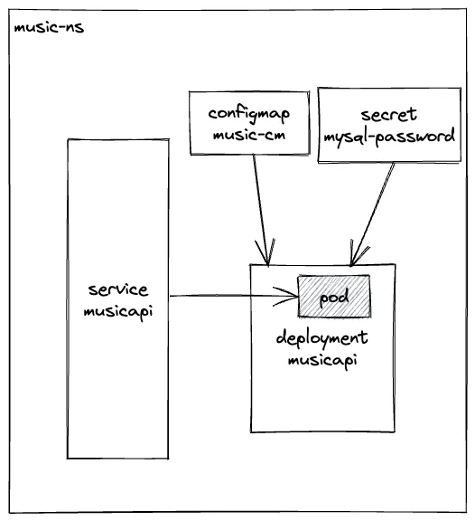
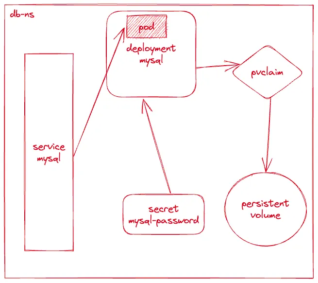

# Project Architecture

## Overview

```plaintext
.
├── README.md
├── backend
│   ├── Dockerfile
│   ├── api
│   │   ├── handlers
│   │   │   ├── playlist_handlers.go
│   │   │   ├── song_handlers.go
│   │   │   └── user_handlers.go
│   │   ├── middleware
│   │   │   ├── jwt_auth.go
│   │   │   └── logging.go
│   │   ├── routes
│   │   │   └── routes.go
│   │   └── utils.go
│   ├── backend
│   ├── db
│   │   └── db.go
│   ├── go.mod
│   ├── go.sum
│   ├── internal
│   │   ├── config
│   │   │   └── config.go
│   │   ├── dao
│   │   │   ├── dao.go
│   │   │   ├── gorm_dao.go
│   │   │   └── mocks
│   │   │       └── music_dao.go
│   │   ├── model
│   │   │   └── types.go
│   │   └── service
│   │       ├── playlist_service.go
│   │       ├── playlist_service_test.go
│   │       ├── song_service.go
│   │       ├── song_service_test.go
│   │       ├── user_service.go
│   │       └── user_service_test.go
│   └── main.go
├── comments.md
├── create-secrets.sh
├── deploy
│   ├── helm
│   └── k8s
│       └── backend
│           ├── musicapi
│           │   ├── api-music-ns.yaml
│           │   ├── configmap-musicapi.yaml
│           │   ├── deployment-musicapi.yaml
│           │   ├── hpa.yaml
│           │   ├── secret-musicapi.yaml
│           │   └── service-musicapi.yaml
│           └── mysql
│               ├── db-ns.yaml
│               ├── deployment-mysql.yaml
│               ├── pvc-mysql.yaml
│               ├── secret-mysql.yaml
│               └── service-mysql.yaml
├── deploy-all.sh
├── docker-compose.yaml
├── images
│   ├── GET_request.png
│   ├── musicapi.png
│   └── mysqldb.png
└── tests
    ├── song_smoke_test.js
    └── user_smoke_test.js

21 directories, 45 files
```

## Backend

The backend is a RESTful API written in Go. It uses the standard library for the API and the GORM library for the database. The API is containerized using Docker and deployed to a Kubernetes cluster. The API has three main resources: users, songs, and playlists.



## Database

The database is a MySQL database that stores user, song, and playlist information. The database is containerized using Docker and deployed to a Kubernetes cluster.


